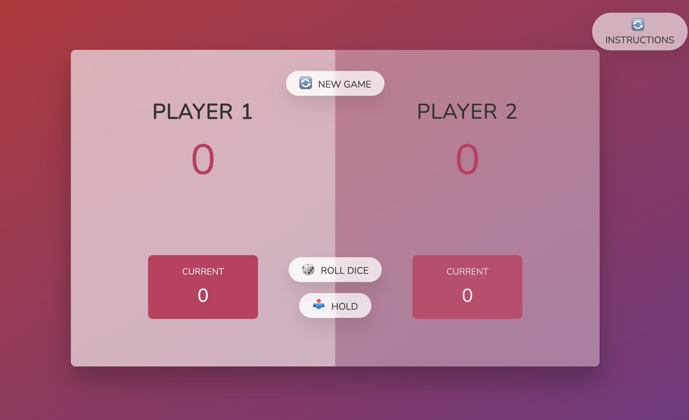
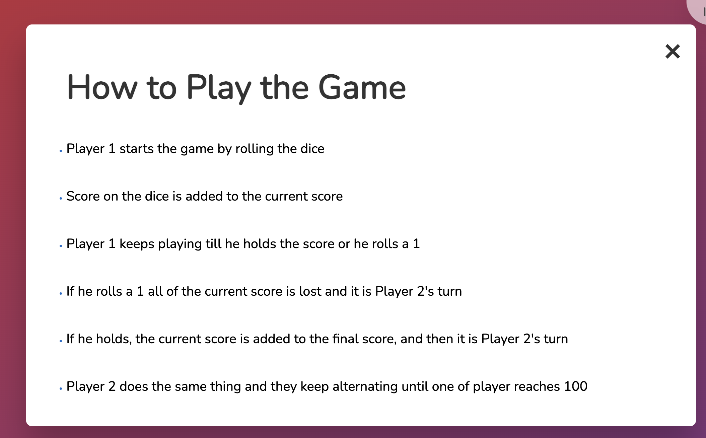

# Dice_Game

A small dice game created to practice using the dom, and assist me on my journey of mastering Vanilla JS

# Front Page
Below is what the front page looks like, which is created using basic HTML and CSS

# Instructions
Instructions on how to play the game, they can also be found on the front page

